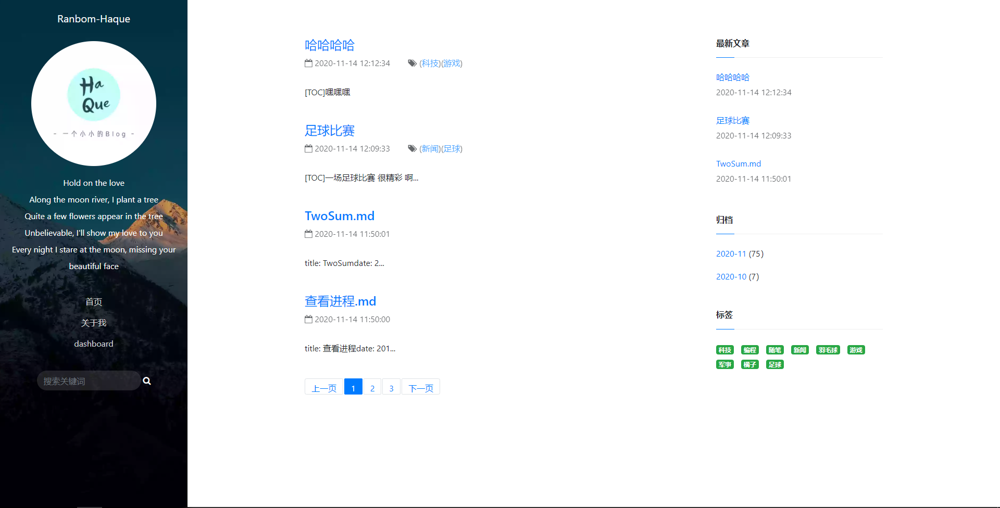
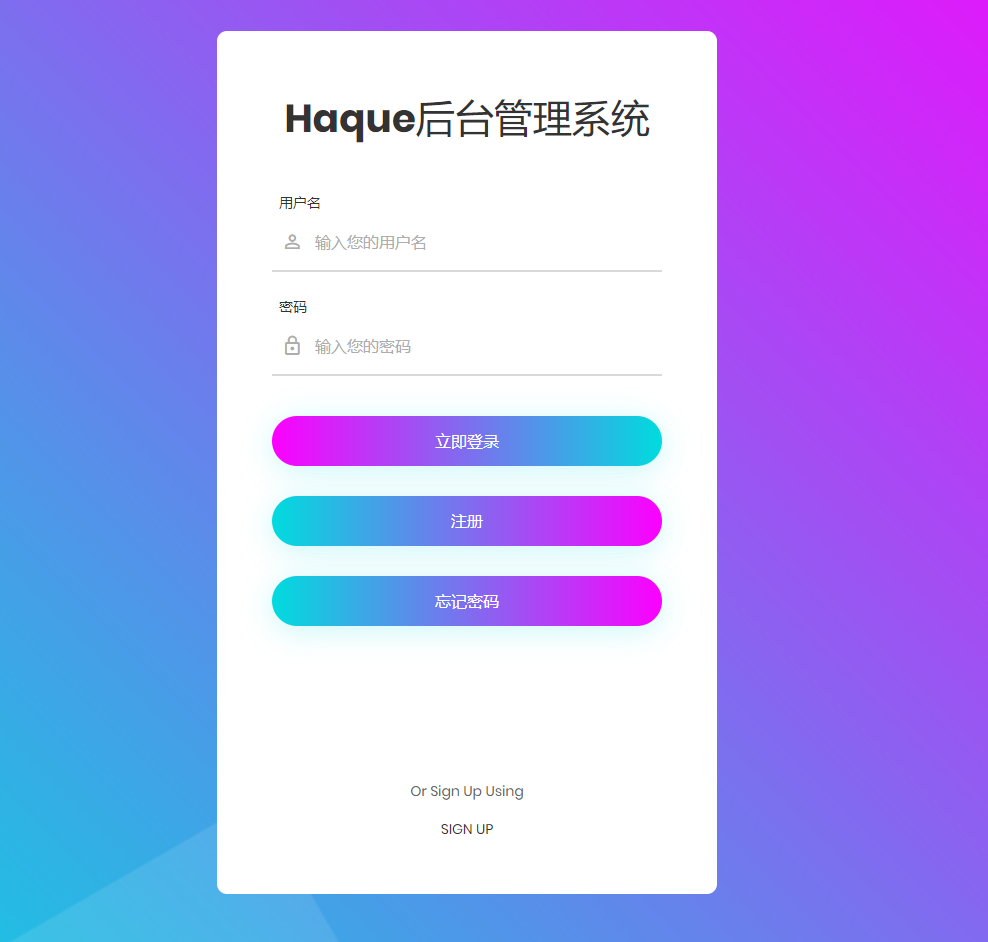
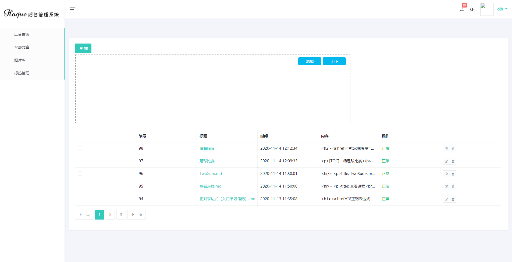

# Haque

#### 介绍

**Haque** `/hɑkjuː/`，可以读为哈Q

✍ An excellent open source blog publishing application. | 一个自认为优秀的开源博客发布应用。

我们的愿景是成为像博客园一样的多用户博客平台，可自定义用户首页，未来将支持多用户，多主题，支持评论...

尽可能打造出近似于个人博客网站的一键式部署方案。

#### 软件架构
##### 展示页前端

1. Thymeleaf
2. Bootstrap4
3. jQuery
4. Font-awesome
5. Ajax

##### 后台管理技术栈

1. SpringBoot
2. redis
3. Mybatis
4. Spring Security
5. Fastjson
6. lombok
7. MySQL8.0
8. Junit
9. logback+slf4j
10. pegdown
11. commons-lang3
12. spring-boot-starter-mail

#### 效果展示

首页

登录页

后台管理页面

#### 主要特性

1.  拥有Restful风格的 Admin api
2.  使用Redis缓存了首页和最近文章
3.  可支持多文件上传
4.  全局搜索

#### 参与贡献

1.  Fork 本仓库
2.  新建 Feat_xxx 分支
3.  提交代码
4.  新建 Pull Request

#### 特技

1.  使用 Readme\_XXX.md 来支持不同的语言，例如 Readme\_en.md, Readme\_zh.md
2.  Gitee 官方博客 [blog.gitee.com](https://blog.gitee.com)
3.  你可以 [https://gitee.com/explore](https://gitee.com/explore) 这个地址来了解 Gitee 上的优秀开源项目
4.  [GVP](https://gitee.com/gvp) 全称是 Gitee 最有价值开源项目，是综合评定出的优秀开源项目
5.  Gitee 官方提供的使用手册 [https://gitee.com/help](https://gitee.com/help)
6.  Gitee 封面人物是一档用来展示 Gitee 会员风采的栏目 [https://gitee.com/gitee-stars/](https://gitee.com/gitee-stars/)
